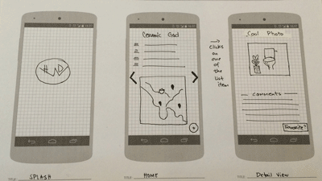

# Ceramic God
"Find a loo near You."

######Moon Paladin Production 
David Aaron, Hang Tran, & Winston Chang

---

An application to help you find the best loo near you. Swipe through Nearby Loo locations, Map views, Reviews, and Interesting photos of facilies from around the globe.

Features:

- Discover great local facilities
- Write reviews and rate to help your fellow bathroom aficionados. 
- Use these to direct you toward the best facilities which to park yourself.
- Take pictures of the facilities to show its condition; please be courteous of others. ;)
- Post your experiences to twitter.
- Get notified if you have lost connection. How exciting...
  Note: Continued use of the GPS running may dramatically decrease battery life.

---

Future update plans:

- Select amenities on review (WiFi Access, Payment Required, etc)
- Rate fellow reviewers.
- Post images to your favorite social media. Because reading text while on the ceramic god is just not as fun.

---
 
 
Wireframe:
 
 
User Stories:

